# SCATTERFIT v1.6

Scatterfit includes two commands for Stata that produce a wide range of scatter plots with overlaid fit lines. `scatterfit` visualizes the relationship between two variables and `slopefit` visualizes the relationship between x and y conditional on another variable z.

To install the package, execute the following command in Stata

```
net install scatterfit, from(https://raw.githubusercontent.com/leojahrens/scatterfit/master) replace
```

Once installed, please see `help scatterfit` and `help slopefit` for the syntax and the whole range of options.

There are two tutorials below that showcase the possibilities of the two commands. 

# Creating plots with scatterfit
## Basics

Scatterfit plots (1) scatter points, (2) fit lines, and optionally (3) confidence intervals. The standard syntax is `scatterfit y x [,options]`. In its simplest form, it is essentially a `graph twoway (scatter y x) (lfit y x)` command, although much better looking by default. Let's see it in action using data from the German European Social Survey sample from 2018-19.

```
scatterfit pinc_net age
```
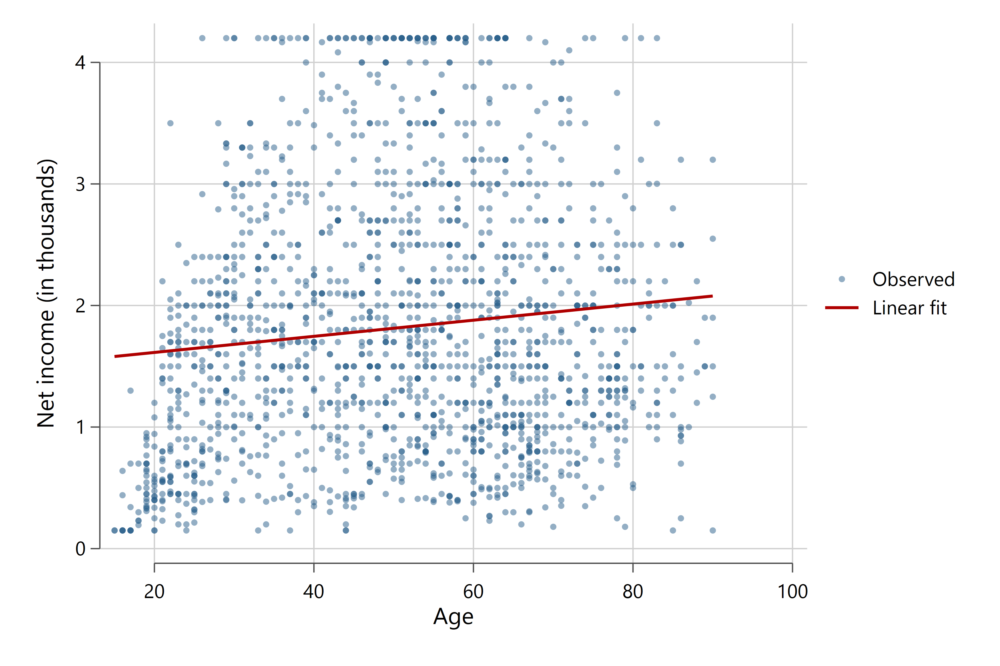

While this graph is easy to rebuild with `graph twoway`, scatterfit has a lot of added functionalities that not only make it better looking than standard Stata graphs but also much more flexible, with very simple syntax.

One of the big upsides of scatterfit is its ability to create binned scatter plots. The data are categorized into a number of bins along the x-dimension (in our example age), after which mean values of y and x are plotted as scatter points.

```
scatterfit pinc_net age, binned
```
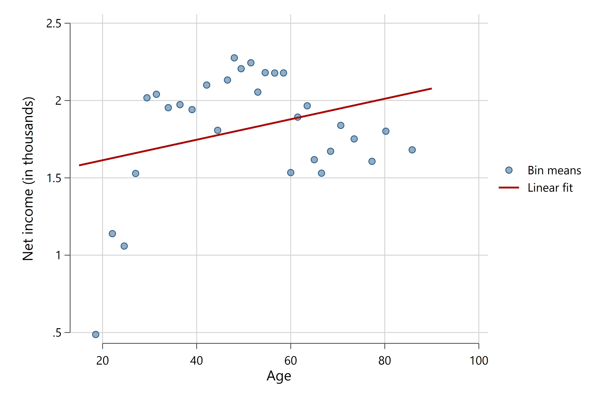

The advantages of binned scatter plots should become apparent. You can get a much better feel of how the variables are related, especially when the original data have a lot of datapoints. Another good use case for binned scatter plots are discrete y variables. By default, these are bundled on a limited number of y-values, such as a 5 point Likert scale. Scatter plots are usually useless with these variables, but binned scatter plots work greatly. Compare the two figures below. 

```
scatterfit redistr pinc_net
scatterfit redistr pinc_net, binned
```
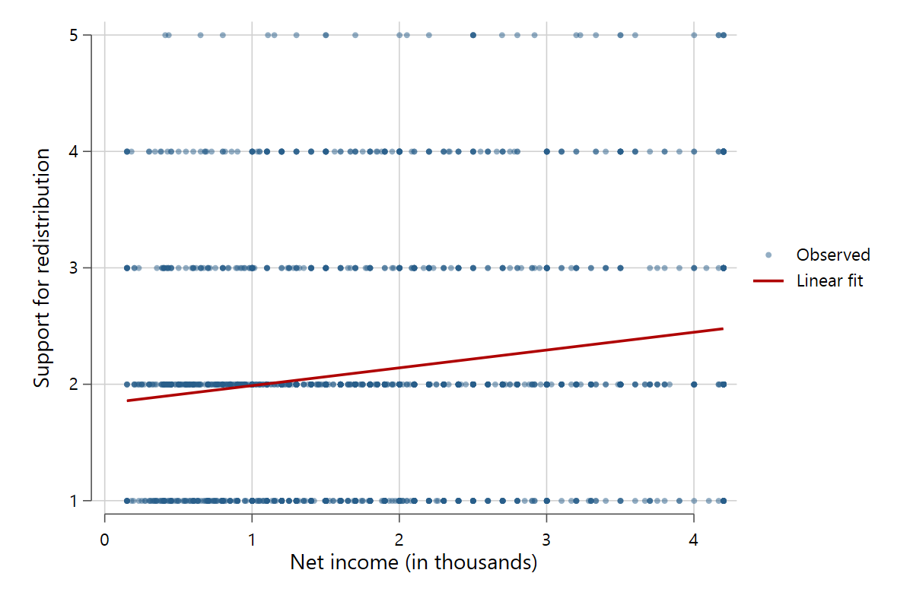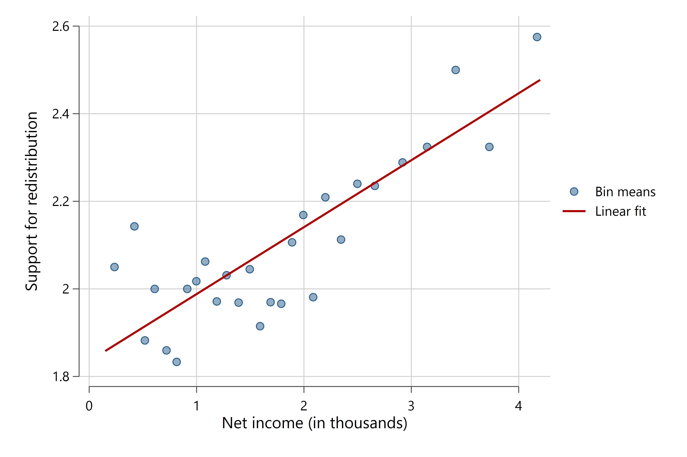

By default, the x variable is binned according to quantile cutoff-points so that the data are categorized into 30 (nearly) equally sized groups. Using the `nquantiles()` option changes the number of equally sized bins. 

```
scatterfit redistr pinc_net, binned nquantiles(50)
```
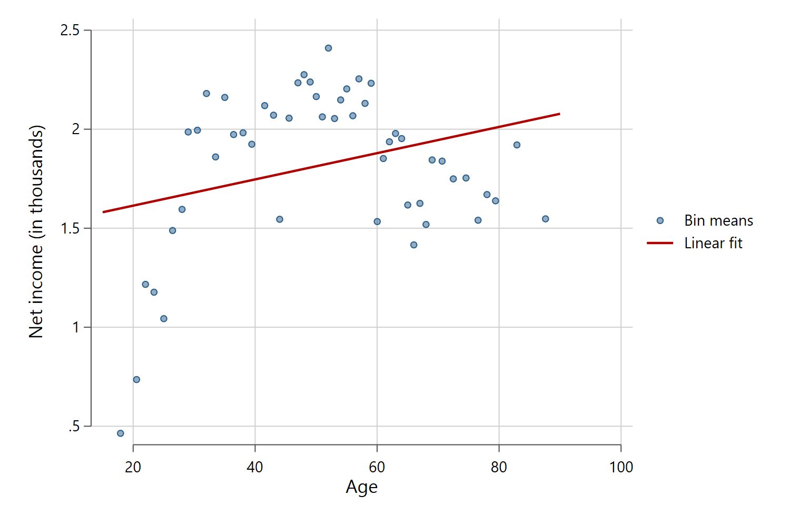

It is also possible to let scatterfit categorize the x variable into equally spaced groups with the option `unibin()`, so that the distance in cutoff points remains constant across the x variable (for example categorizing a variable from 0 to 100 into two equally spaced groups would result in the two categories 0-50, >50-100). As a result, the number of observations within each bin may differ.
 
```
scatterfit pinc_net age, binned unibin(30)
```
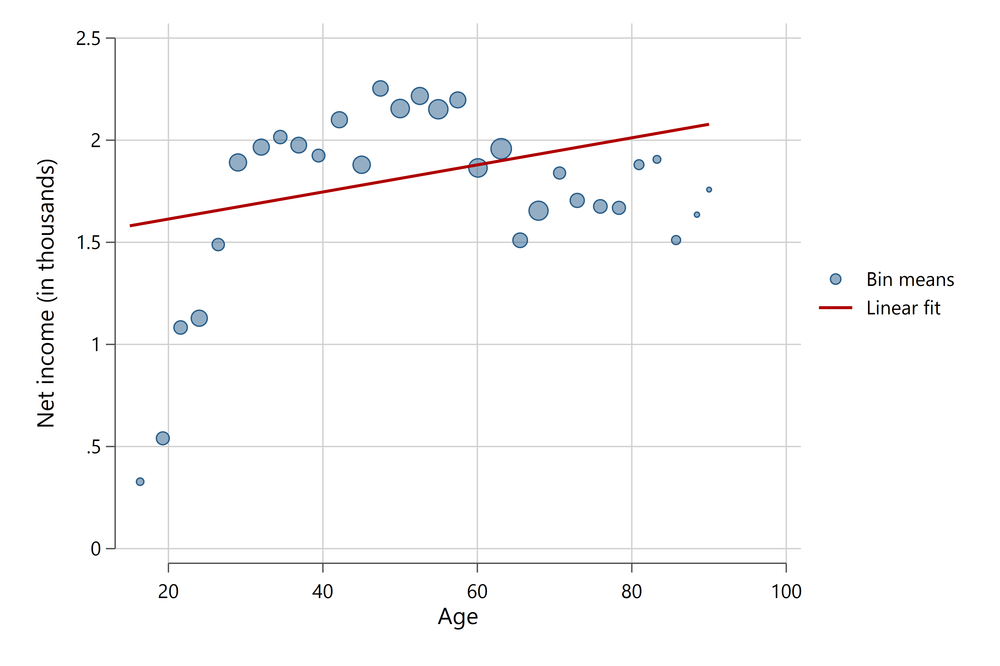

Scatterfit can also treat the x variable as discrete, using each distinct value of x as a bin.

```
scatterfit pinc_net age, binned discrete
```


Use the `mweighted` option to visualize the differing amount of observations within the bins.

```
scatterfit pinc_net age, binned discrete mweighted
```
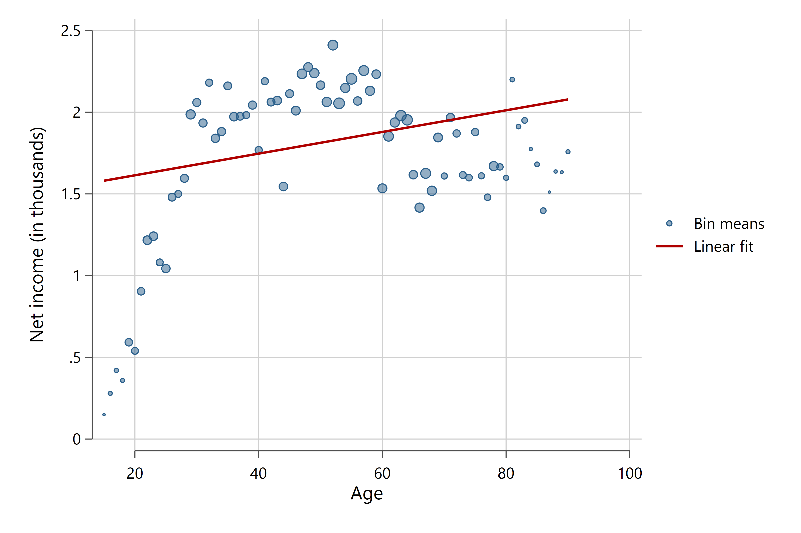

The last option is to use `binvar()` to use a variable that already defines all the bins.

## Binary dependent variables

The command also works with binary dependent variables. It will automatically detect if the y variable only has two distinct values (after accounting for sample reductions via listwise deletion and if/in). No matter the underlying scale, scatterfit will transform the variable into a dummy where the original value with the higher scale point gets the "1" coding. Of course, scatter plots make little sense for binary dependent variables because all points are bundled on 0 and 1. But, you guessed it, binned scatter plots work just fine. The points and fit line show the proportion of respondents in the "1" rather than the "0" category.

```
scatterfit right pinc_net, binned
```
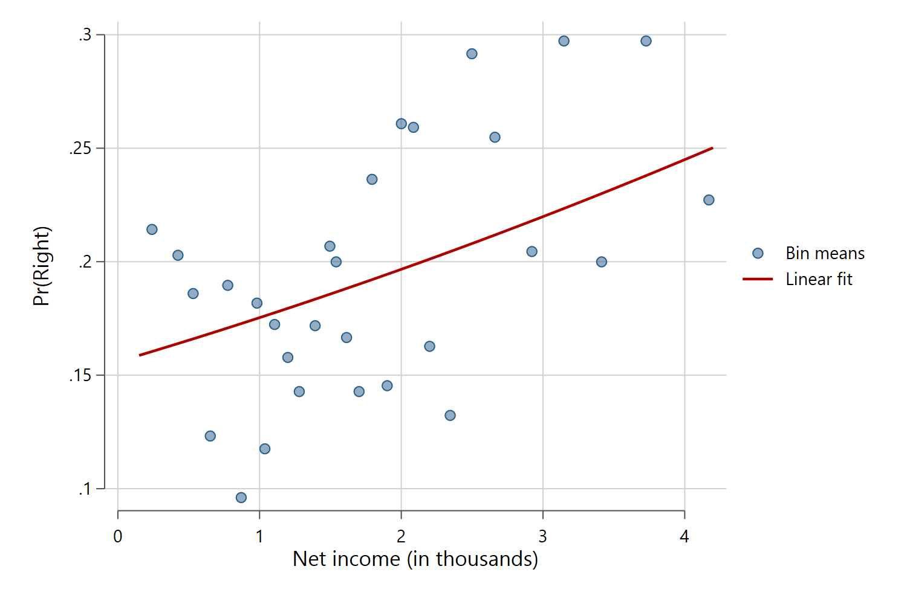

The fit line in the binary DV case is derived from linear predictions based on a logit model that is calculated internally.

## Fit types

The command supports several fit lines, manipulated via the `fit()` option. The standard setting is `fit(lfit)` for a linear fit with no confidence intervals. Other possible settings are `fit(lfitci)` to include confidence intervals, `fit(qfit)` or `fit(qfitci)` for quadratic fits, `fit(poly)` or `fit(polyci)` for local polynomial fits, and `fit(lowess)` for a lowess smoother. Use the `bwidth()` option to control how fine-grained the smoothing is for local polynomial and lowess fits. Here are some examples.

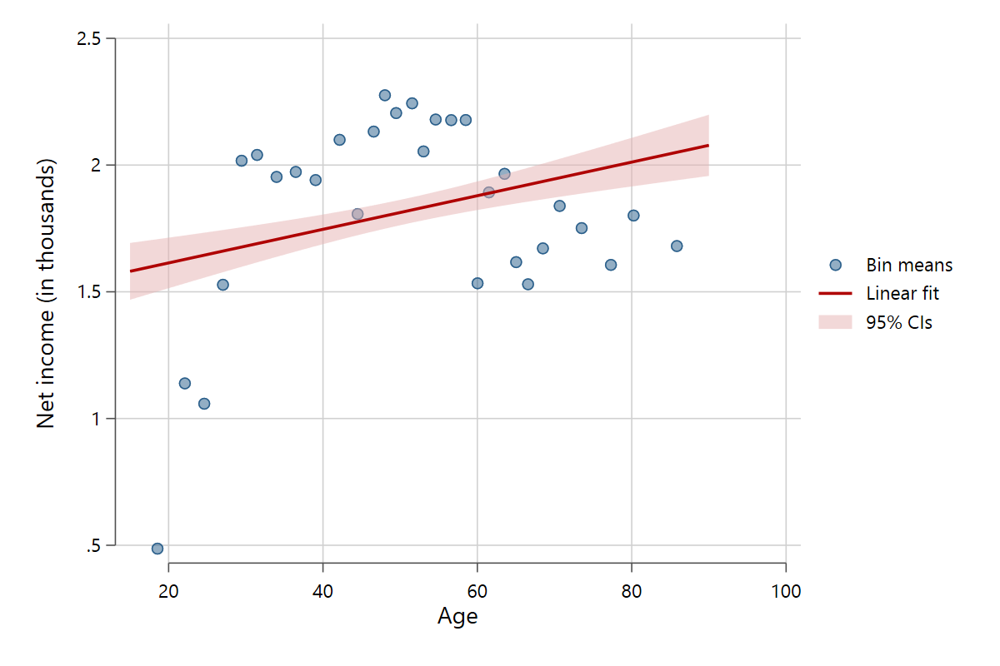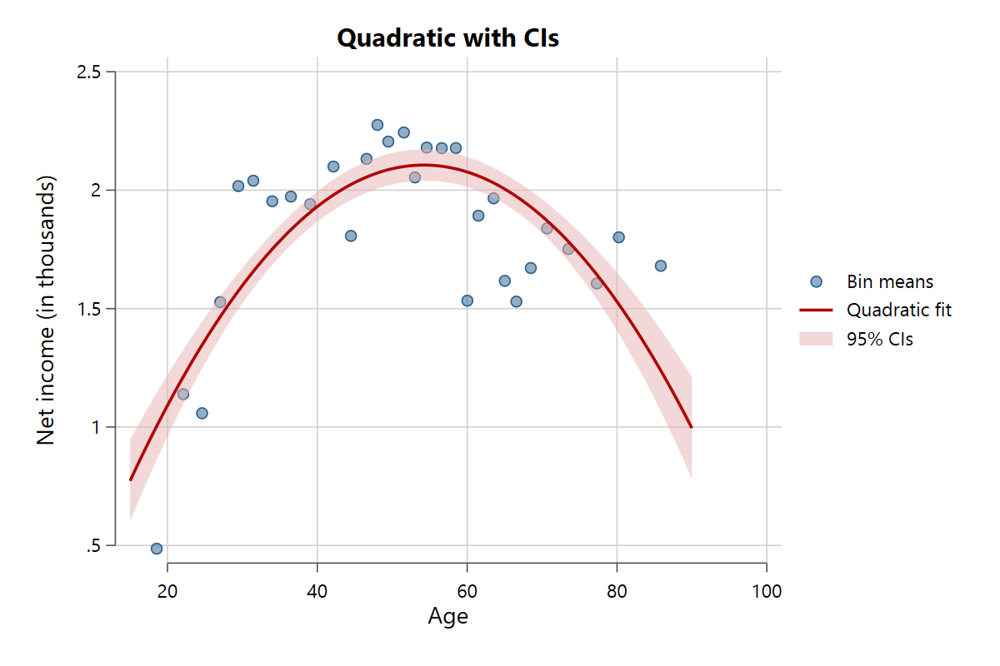
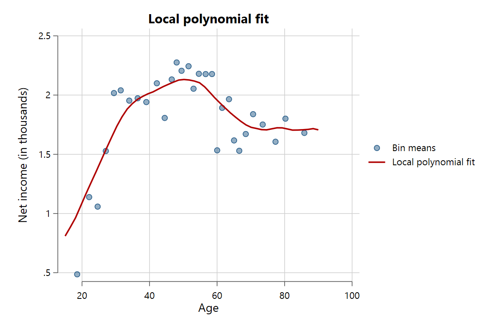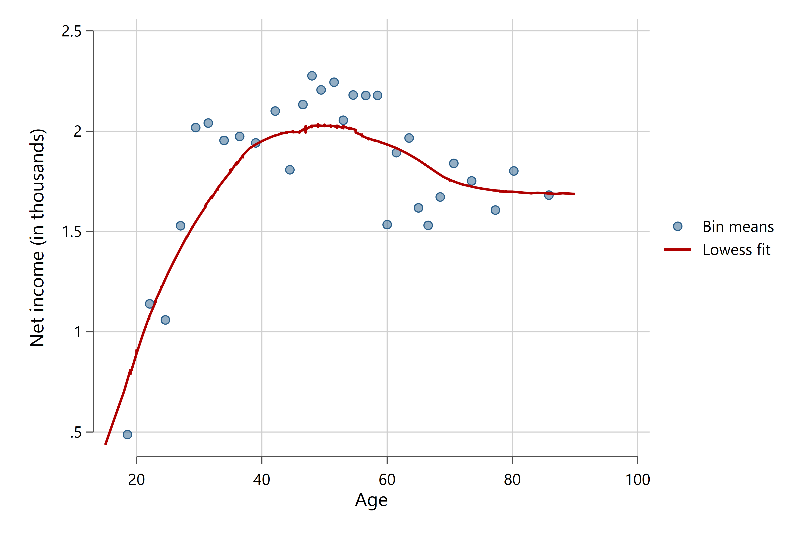

## Multiple plots along a by-dimension

The relationship between x and y can be broken down so that separate scatter points and fits are plotted for each value of the variable defined in `by()`. Here is the relationship between age and income with separate plots for men and women.
```
scatterfit pinc_net age, binned fit(lfitci) by(gender)
```
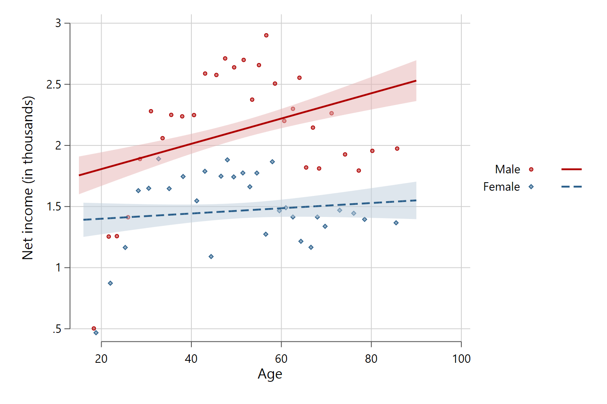

This is also a good opportunity to showcase the `mlabel()` option, which replaces the usual scatter markers with a string contained in a separate string variable or a numeric variable with labeled values.
```
scatterfit pinc_net age, binned by(gender) mlabel(genderlab)
```
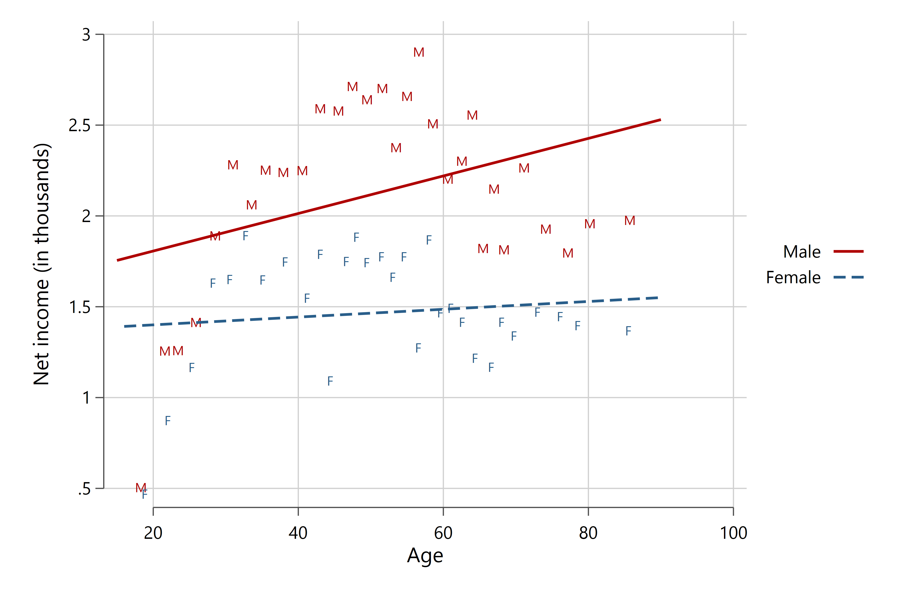

## Control variables

Scatterfit makes it possible to plot fitted scatterplots after accounting for control variables. If at all, researchers mostly use fitted scatterplots as a step preliminary to the "real" data analysis. The results are treated as descriptive, mostly because scatterplots are bivariate and, in their simple form, do not consider covariates. 

`scatterfit` can pre-treat the data so that the plots only show the residual covariation between x and y after accounting for control variables. This is achieved by first regressing the x and y variables on the control variables and then using the residuals for the plots. If binned scatterplots are involved, this becomes slightly more complicated; see "Cattaneo et al. 2022 - On Binscatter". Scatterfit uses the simple residualization method for all plots without bins and the Cattaneo et al. method for all binned scatterplots.

The `controls()` option is used to control linearly for continuous variables (no factor-notation such as i.x allowed!), and the `fcontrols()` option is used for categorical / factorized variables. Let's see it in action!

```
scatterfit pinc_net age, binned controls(eduyrs) fcontrols(educ emp)
```
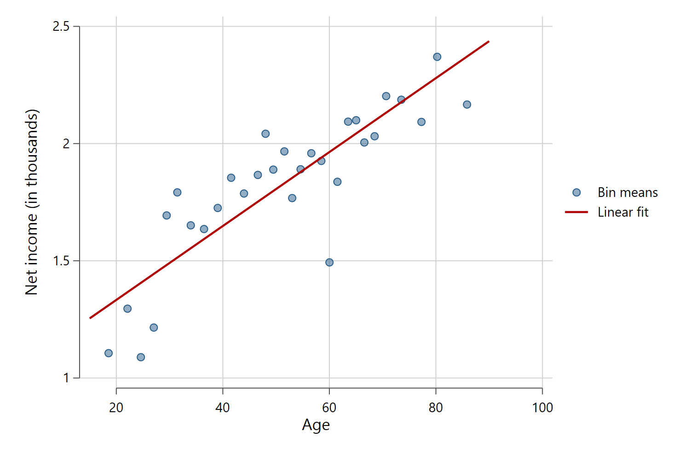

You will see that, even though the variables are residualized, both x and y appear to be on their original scale. This is because scatterfit adds the means of the variables back after residualization so that the variables stay on a familiar scale. That is, what you see is the residual variation relative to the mean. If you are unhappy with this behavior, use the `standardize` option to z-standardize both x and y in the plot.

## Regression parameters

The `regparameters()` option allows the user to print parameters from a regression between y and x (and, possibly, covariates) into the plot. Allowed are 'coef' for the slope coefficient, 'se' for its standard error, 'pval' for the p-value of a null-hypothesis test, 'sig' for significance stars on the coefficient (*<.1, **<.05, ***<.01), 'r2' for r-squared, 'adjr2' for adjusted r-squared, and 'nobs' for the number of observations. 
```
scatterfit pinc_net age, binned regparameters(coef se pval sig adjr2 nobs) parpos(.9 85)
```
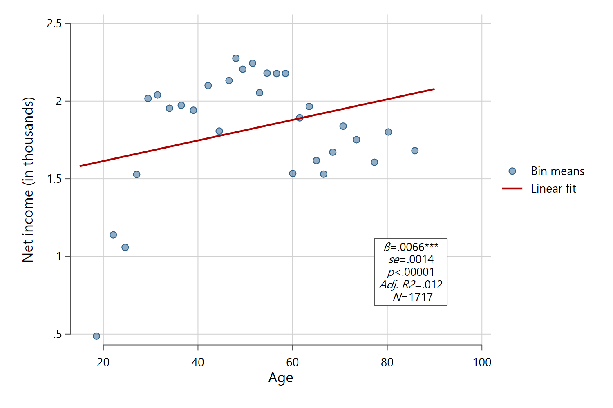

The program tries to find a good position for the parameters, but this is not always successful. In this case, I used the `parpos()` option to specify the position of the text box.

## Interaction models

If `by()` is specified, the usual behavior of scatterfit is to stratify the sample and plot the relationship between x and y separately for each by-level. Using the `bymethod(interact)` option specifies that the results are rather obtained from an interaction regression model where x is interacted with each by-factor. When no control variables are specified, this leads to identical results, while the results may vary somewhat in the presence of controls.

The interesting part is that it now becomes possible to plot regression parameters for the interaction(s). Just add the argument 'int' to the `regparameters()` option to receive the specified parameters for the interaction terms as well. 

```
scatterfit redistr pinc_net, binned by(labf) bymethod(interact) regparameters(coef pval sig int)
```
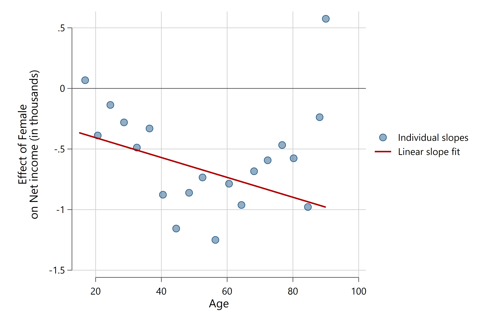

In this example, it becomes evident that those who are part of the labor force have a significantly stronger slope coefficient of income on support for redistribution.

## Changing the overall look

While scatterfit comes with a predefined look that differs considerably from the gory Stata standard, the user may prefer a different look. The `plotscheme()` can be used to define an alternative plot scheme. You can use a Stata-native or user-written scheme here. And `colorscheme()` changes the color palette. Either put a pre-defined color palette such as s2color or tableau here, or define your own colors using a list of hex colors (for example, `colorscheme(#E6007E #009FE3 #312783)`). It is advised that you also change the color palette when you change the overall plot scheme.

```
scatterfit pinc_net age, binned plotscheme(white_tableau) colorscheme(tableau)
```
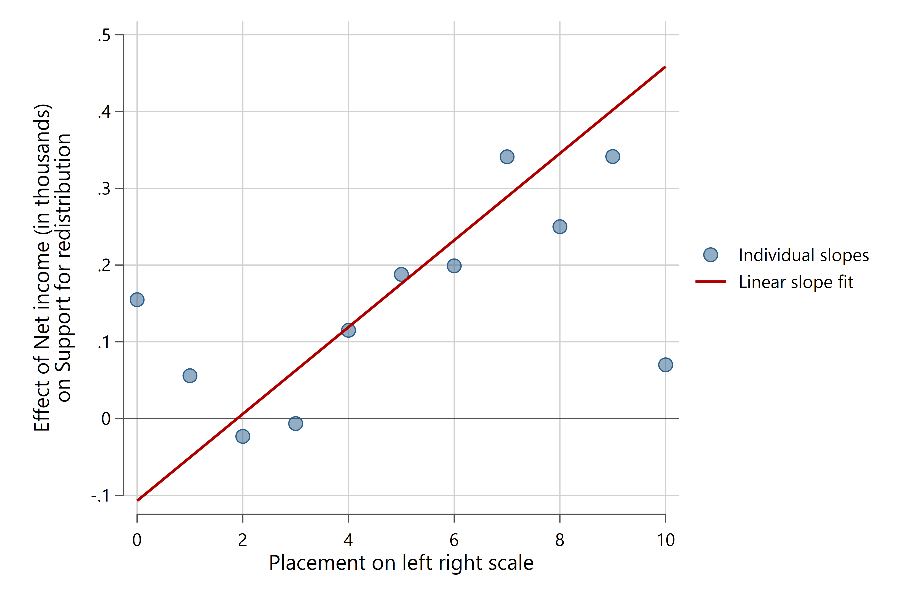


# Creating plots with slopefit

Slopefit visualizes the relationship between x and y conditional on a continuous variable z. It also creates scatter plots with overlaid fit lines, but in a different way. Both the scatter points and the fit line show the slope (i.e. effect) of x at different values of z. The fit line is derived from a simple interaction model that assumes that the effect of x changes linearly with z. In contrast, the scatter points show effects of x within user-defined bins of z (say, the effect of x at the first decile of z, etc). These individual slopes are derived from an interaction regression model that uses a factorized version of z to get separate slope coefficients for different subsets of z.

The following examples will acquaint you with the basics, but it will be much more brief than the tutorial for scatterfit because the two commands share a lot of functionalities. For example, changing the overall look of the figure works identically in the two commands.

## Basics

There are several methods to create the bins of z. As with scatterfit, the standard setting is to categorize z into equally sized bins based on quantile cutoff points. 

```
slopefit pinc_net gender age, method(quantiles) nquantiles(20)
```
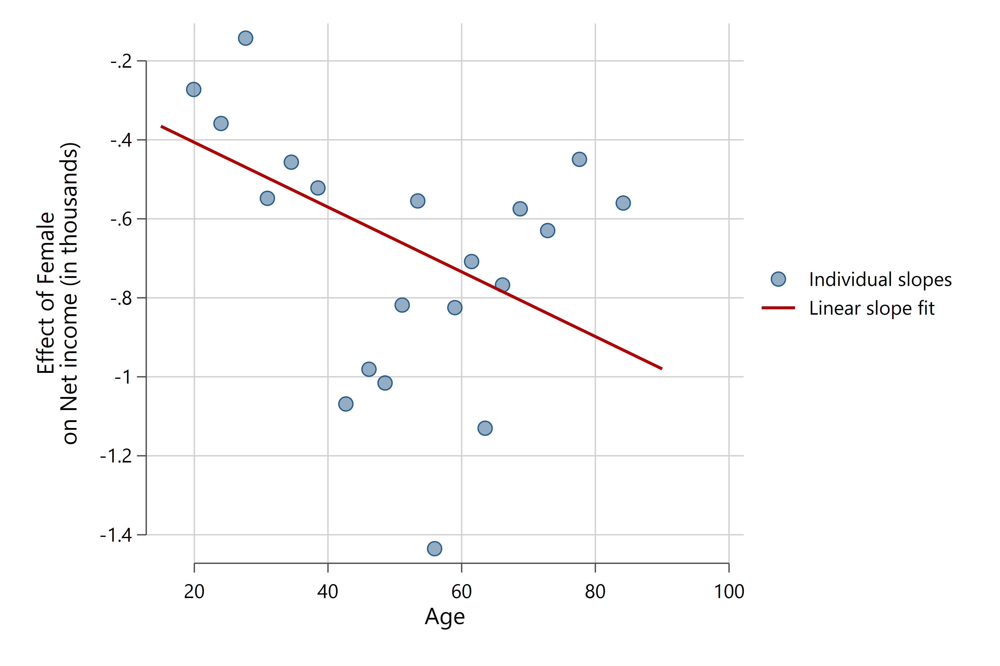

In this example, the fit line shows the results from the continuous interaction model, and the lowest scatter marker shows the effect of x among those within the bottom 5% of the z distribution. 

Similar to scatterfit, the bins can also be created by sorting z into equally spaced bins.


```
slopefit pinc_net gender age, method(unibin) nunibin(20)
```
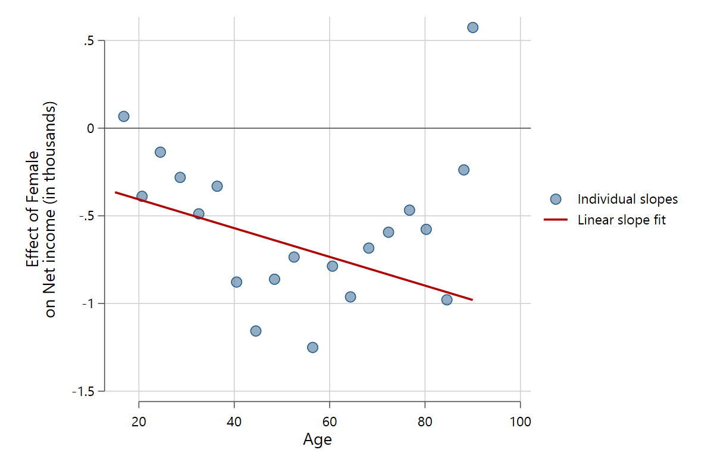

Or by treating z as discrete and using every single distinct value.

```
slopefit redistr pinc_net rile, method(discrete)
```
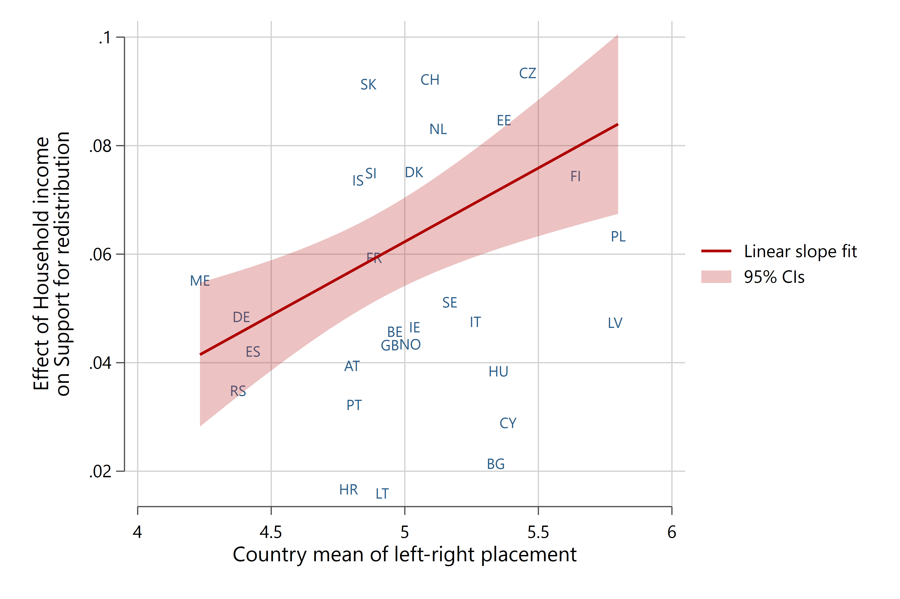

The last variant to create the bins of z is to use a user-defined binning variable that already exists in the dataset. In the following example, I will use multi-country survey data from the ESS and define the individual countries as the bins via `binvar()`. In effect, the scatter markers show the individual slope coefficients for the each country in the sample. 

```
slopefit gincdif hinctnta rilemean, binvar(cntry) mlabel(cntry)
```
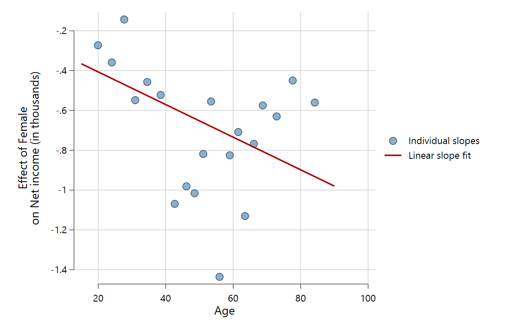

The previous example also shows the `mlabel()` option, which replaces the usual scatter markers with labels from a string variable or labeled numerical variable (in this case the country codes).

## Confidence intervals and fit lines

The `fit()` option governs options how the main fit line, derived from the linear interaction of x and z, is plotted. You may use 'lfit', 'lfitci', 'qfit', and 'qfitci'. We'll use lfitci here to add confidence intervals to the plot.

```
slopefit redistr pinc_net rile, method(discrete) fit(lfitci)
```
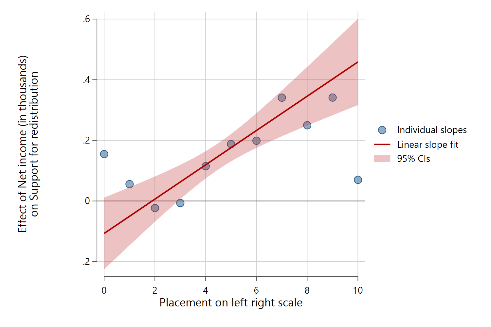

It is also possible to plot the confidence intervals of the individual slopes with `indslopesci`, in this case at all distinct values of peoples' left-right self-placement.

```
slopefit redistr pinc_net rile, method(discrete) fit(lfitci) indslopesci
```
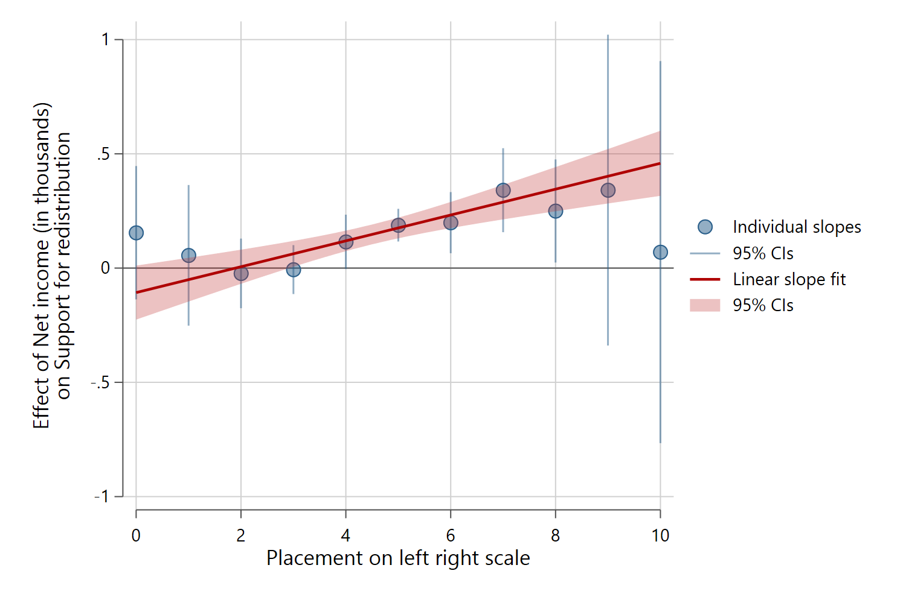

Lastly, the `vce()` option changes the calculation of the standard errors in the underlying regressions, which influences all uncertainty estimates.

```
slopefit redistr pinc_net rile, method(discrete) fit(lfitci) indslopesci vce(robust)
```

## Control variables

Just as with scatterfit, it is simple to add control variables to the underlying regressions to get the partial relationship between x and y at different values of z. Use the `controls()` option to add continuous controls and `fcontrols()` for categorical controls.

```
slopefit redistr pinc_net rile, method(discrete) controls(age) fcontrols(gender educ emp)
```

## Regression parameters

The `regparameters()` option includes parameters from the interaction regression that uses a linear interaction term between x and z (i.e., the regression that results in the overall fit line). 'coef' shows the extent to which the effect of x changes linearly as z increases by one unit, 'pval' the associated p-value, 'sig' prints significance stars onto the interaction coefficient (*<.1, **<.05, ***<.01), and 'nobs' shows the number of observations. 

```
slopefit redistr pinc_net rile, method(discrete) regp(coef sig pval nobs)
```
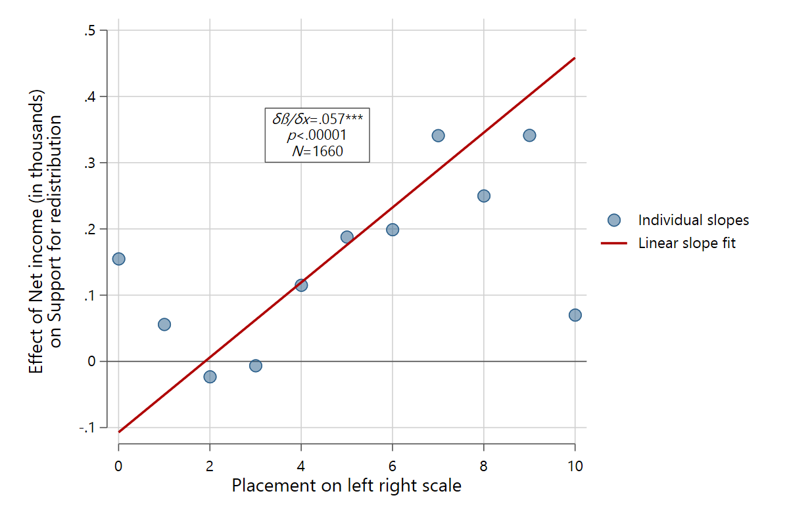

In this case, the results show that the effect of income increases significantly as people become more right-leaning.
